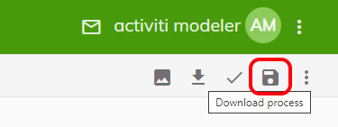

# Activiti 7.1.0M9

[](https://spring.io/projects/spring-cloud)      [](https://www.docker.com/)   [](https://kubernetes.io/)

# Runtime Bundle vs Cloud Connectory

1. Założenia w tworzeniu oprogramowania są takie aby tworzyć mikroserwisy, które można deployować np. do Kubernetessa - zamiast tworzyć 1 gigantyczną aplikację monolityczną.
2. Mikroserwisy komunikują się między sobą główne za pomocą REST'a albo w ramach implementacji strumieni jaką mamy w Spring'u (docelowo wykorzystywany jest system kolejkowy np. **RabbitMQ, Kafka**)
3. **Runtime Bundle** posiada silnik BPM Activiti, który buduje instancje procesów na podstawie ich definicji, realizuje przepływ danych w ramach procesów, wykonywanie inwokacji zadań, wystawia także API (Endpoint Restowy) dla zdalnych serwisów chcących np. zainicjować uruchomienie procesu do zakupu usługi, dokonać potwierdzenia user Tasku, etc. 
4. **Runtime Bundle** komunikuje się z innymi systemami / instancjami Activiti za pomocą strumieni - do tego służą **Cloud Connectory** zapewniając przepływ informacji pomiędzy rozproszonymi instancjami
5. **Cloud connector** jest implementacją Service Tasku (aczkolwiek można implementować serwis task w postaci Beana i wtedy przepływ informacji zamyka się w ramach Runtime Bundle, pozwalającą na komunikację z innymi usługami czy to za pomocą wywołań REST, Socket, strumieni, etc.
6. Komunikacja pomiędzy **Cloud Connectorem(ami)** a **Runtime Bundle(ami)** odbywa się za pomocą strumieni (np. **RabbitMQ**, **Kafka**)
7. **Zasadnicza różnica między implementacją zadań serwisowych (Service Task) w aplikacji zawierającej silnik BPM (Runtime Bundle) a cloud connectorami jest taka, że :**
* **Cloud connectory służą do rozproszenia przetwarzania zadań w modelu cloudowym, posługując się przy tym strumieniami jako nośnikami danych**
* **Cloud connectory mogą być niezależnie deployowane na dowolnych środowiskach (ważne żeby była dostępna JAVA) - ważne jest tutaj zapewnienie komunikacji strumieni z np. systemem kolejkowym RabbitMQ, przez który odbywa się wymiana danych pomiędzy środowiskiem uruchomieniowym a Cloud Connectorem.**

# Modelowanie procesów biznesowych - UI

W repozytorium https://git.man.poznan.pl/stash/projects/PRACELAB/repos/activiti-core/browse/Local/Modeler%20BPM?at=develop znajduje się konfiguracja Activiti Modelera dla lokalnego deploymentu w środowisku developera. **UWAGA: w pliku .env należy ustawić adres IP (dockerIP) interfejsu pod którym będzie osiągalny nginx, który zostanie zdeployowany w ramach paczki. Nie należy podawać adresu 127.0.0.1 - zakłóci to działanie 1 z komponentów.** Po skonfigurowaniu adresu wystarczy wykonać polecenie **make all**.
W ramach paczki zostaną zdeployowane następujące komponenty:
1. Nginx
2. Keycloak
3. ctiviti-cloud-modeling - UI
4. ctiviti-cloud-modeling-backeng

Instacja keycloaka ma m.in. następujące konta:

Admina:
login :**admin**
password: **admin**

Modelera:
login :**modeler**
password: **password**


Gdy mamy już coś zamodelowane i chcielibyśmy użyć definicji procesów w naszej aplikacji to wystarczy je pobrać klikając na przycisk:


Możemy pobierać poszczególne procesy(*.xml) albo cały projekt (zip).
**Uwaga** - dobrze jest kopiować również jsona z zakładki Extensions Editor (nie wiem czemu nie zrobili jeszcze downloadu automatycznego), w której definiowane są mapowania zmiennych, etc - ma to szczególne znaczenie przy importowaniu procesów do Modelera. Należy zapisywać plik z zawartością pod taką samą nazwą jak nazwa procesu, tylko na końcu dopisujemy fragment **-extensions.json** np.
- Proces: **request-student-contract.bpmn20.xml**
- Plik z extensions do procesu: **request-student-contract-extensions.json**

Pobrane procesy(projekt) oraz pliki extensions należy umieścic (każdy plik xml musi być wypakowany i wrzucony pojedynczo) w katalogu \src\main\resources\processes\ naszej aplikacji (Runtime Bundle) - będzie o tym jeszcze wzmianka w części ***Uwagi do kodów źródłowych***

# Struktura repozytorium

Repozytorium procesów: https://git.man.poznan.pl/stash/projects/PRACELAB/repos/activiti-processes/browse
- Główne środowisko wykonawcze BPM - **Runtime Bundle** , SpringBoot2, wymagana jest JAVA 11
- Cloud Connectory - implementacja procesów serwisowych realizujacych komunikację pomiędzy systemami i komunikujących się z Runtime Bundle za pomocą strumieni (**RabbitMQ**), implementacja w JAVA 11 i SpringBoot2.

Struktura katalogów odzwierciedla następujące elementy
```
./portals/
```
W tej części będą tworzone poszczególne aplikacje realizujące określone funkcjonalności, np. contracts, registrations, etc.

```
./services/
```
Implementacje procesów związanych z usługami np. Openstack, Ceph, etc.

```
./templates/
```
Przykładowe szablony mikroserwisów w oparciu o SpringBoot2 i zintegrowany silnik Activiti7.


# Uwagi do kodów źródłowych

- W plikach properties (application.properties) zdefiniowano wiele elementów opisujących zdalne endpointy do **KeyCloaka**, **RabbitMQ**, definicję kolejek dla Cloud Connectorów, port dla serwera REST, dane do bazy PostgreSQL, etc.
```
/src/main/resources/application.properties
```
- Utworzone za pomocą Modelera procesy (*.xml) oraz pliki extensions należy przekopiować do katalogu z kodami źródłowymi naszego **Runtime-Bundle**
```
/src/main/resources/processes/
```
- Podczas startu platformy, silnik Activiti skanuje ww. katalog w poszukiwaniu definicji procesów, definicji mapowań (**extensions**) i na tej podstawie buduje ich reprezentację

# Development

Polecane środowisko : **IntelliJ IDEA**
Ale można działać w zasadzie w czym się podoba (Netbeans, Eclipse, etc) - pełna dowolność

Do działania poszczególnych implementacji mikroserwisów (w tym również szablonów) wymagane są:
1. PostgreSQL*
2. Rabbit

PostgreSQL może być zastąpiony na czas developmentu przez bazę H2 -> przykład /templates/microservice_with_rabbit

W każdym katalogu zawierającym kody źródłowe mikroserwisu jest katalog docker-compose, zawierający konfigurację niezbędną do działania lokalnej instancji developerskiej.
Oczywiście jeśli mamy gdzieś już postawionego PostgreSQL'a, Rabbita to można takie instancje użyć implementacji developerskiej.
